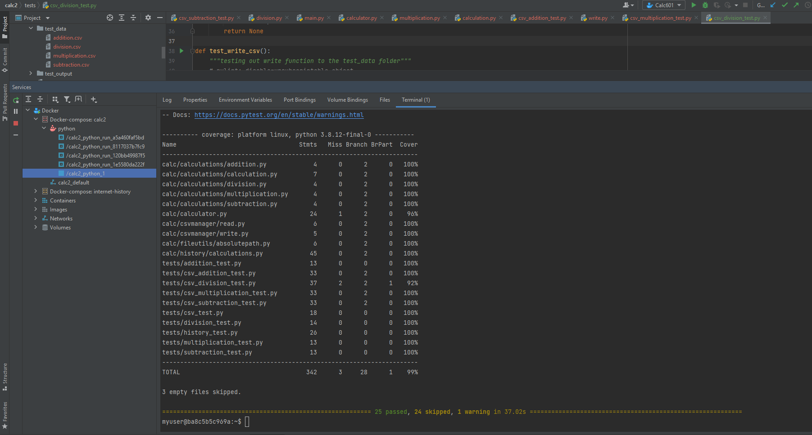
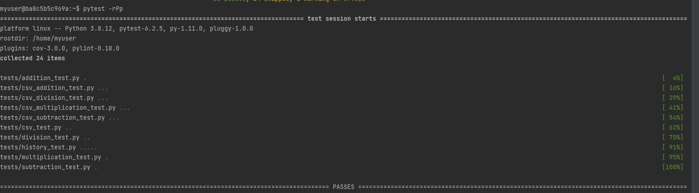
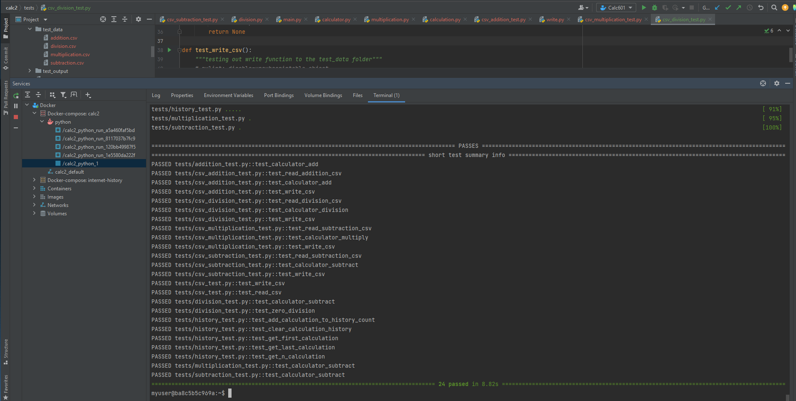

<h1 class="center">
Class IS601 - Web Systems Development 
</h1>

***

## Creator
Jenie Kunnipparampil

***
## CSV Assignment
* This assignment puts emphasis on the csv import and write functions.
* Pytests were set up to test the calculation functions that we set up along with the ability to store the values 
* In this exercise we tested the code's ability to import and export csv files from the designated location
* Please refer to the below screenshots that look at Pytest and coverage test carried out.
 
 

* <b>Coverage Test</b>

<kbd></kbd>
 

* <b>Pytest Pass Check - Part 1</b>

<kbd></kbd>
 

* <b>Pytest Pass Check - Part 2</b>

<kbd></kbd>